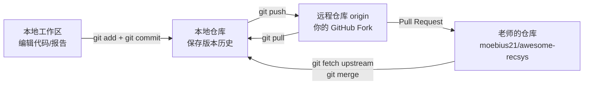

# GitHub 基本操作指南

本指南面向第一次使用 GitHub 的同学。你不需要一次学会所有 Git 命令，先按下面的流程完成一次提交即可。

## 1. 先理解三个概念

- **Git**：安装在电脑上的版本管理工具。
- **GitHub**：存放 Git 项目、协作和提交 Pull Request 的网站。
- **仓库（Repository）**：一个项目的代码、文档和历史记录。

本课程项目地址：

<https://github.com/moebius21/awesome-recsys>

## 2. Git、GitHub、本地和远程

**Git** 是一个版本管理工具。它会记录文件每次修改的历史，让你可以查看差异、恢复旧版本，并与他人协作。

**GitHub** 是托管 Git 仓库的网站。它提供代码存储、网页浏览、Issue、Pull Request 和协作权限等功能。Git 和 GitHub 不是同一个东西：Git 可以在没有 GitHub 的情况下使用，GitHub 则主要使用 Git 来管理项目。

- **本地仓库（local repository）**：电脑上的项目目录，以及其中隐藏的 `.git/` 历史记录。你平时编辑代码、运行实验和执行 `commit`，主要都在本地完成。
- **远程仓库（remote repository）**：GitHub 上的项目副本，例如 `moebius21/awesome-recsys`。它用于备份、共享和协作。
- **origin**：远程仓库的一个名字。Clone 后，`origin` 通常指向你自己的 GitHub 仓库。
- **upstream**：远程仓库的另一个名字。在本课程中，通常用 `upstream` 指向老师的原始仓库。

可以把它理解成：本地仓库是你的工作区，远程仓库是 GitHub 上的共享副本。两者不会自动保持一致，需要用命令同步。



最常见的一次作业流程是：

```text
修改文件 → git add → git commit → git push → GitHub 上创建 Pull Request
```

## 3. 第一次使用：安装和配置 Git

安装 Git：<https://git-scm.com/downloads>

安装后打开终端，执行：

```bash
git --version
git config --global user.name "你的姓名或 GitHub 用户名"
git config --global user.email "你的 GitHub 邮箱"
```

`user.name` 和 `user.email` 会写入提交记录。邮箱建议使用 GitHub 账号中已验证的邮箱。

## 4. Fork 老师的仓库

1. 打开项目主页。
2. 点击右上角 **Fork**。
3. 选择你的 GitHub 账号。
4. 创建成功后，你会得到一个属于自己的仓库，例如：

   `https://github.com/你的用户名/awesome-recsys`

以后不要直接修改老师的仓库，先在自己的 Fork 中完成作业。

## 5. Clone 到本地电脑

打开你自己的仓库，点击 **Code → HTTPS → Copy**，然后在终端执行：

```bash
git clone https://github.com/你的用户名/awesome-recsys.git
cd awesome-recsys
```

检查当前仓库：

```bash
git remote -v
git status
```

## 6. 创建自己的分支

不要直接在 `main` 分支上写作业：

```bash
git switch -c homework/你的学号
```

例如：

```bash
git switch -c homework/20230001
```

查看当前分支：

```bash
git branch --show-current
```

## 7. 提交作业文件

复制 `submission-template/`，把作业放到：

```text
submissions/你的学号-你的姓名/
```

建议先查看修改内容：

```bash
git status
git diff
```

确认无误后提交：

```bash
git add submissions/你的学号-你的姓名/
git commit -m "Submit recommendation system project"
```

提交信息要说明这次做了什么，不要使用 `update`、`test` 这类无法说明内容的标题。

## 8. Push 到自己的 GitHub 仓库

```bash
git push -u origin homework/你的学号
```

第一次 Push 时，GitHub 可能要求浏览器登录或授权。不要把密码、Token 写进命令或提交到代码里。

## 9. 创建 Pull Request

Push 成功后打开自己的 GitHub 仓库，通常会看到 **Compare & pull request**，点击它。

确认页面上的方向是：

```text
base repository: moebius21/awesome-recsys
base branch:    main
head repository: 你的用户名/awesome-recsys
compare branch:  homework/你的学号
```

标题建议写：

```text
[作业] 学号-姓名：MovieLens 推荐系统
```

正文至少说明：

- 使用了什么数据集和模型
- 如何运行
- 主要实验结果
- 已知问题或未完成部分

最后点击 **Create pull request**。Pull Request 提交后，老师会在 GitHub 上检查代码并留言。

## 10. 根据老师意见修改

Pull Request 不需要重新创建。继续在同一个分支修改：

```bash
git add .
git commit -m "Address review comments"
git push
```

新的提交会自动出现在原来的 Pull Request 中。

## 11. 同步老师仓库的最新内容

第一次同步前，添加老师仓库地址：

```bash
git remote add upstream https://github.com/moebius21/awesome-recsys.git
```

以后同步：

```bash
git fetch upstream
git switch main
git merge upstream/main
git push origin main
```

如果你的作业分支需要同步最新模板，再执行：

```bash
git switch homework/你的学号
git merge main
```

## 12. 最常见的问题

### `git: command not found`

Git 没安装，先从 <https://git-scm.com/downloads> 安装，然后重新打开终端。

### `nothing to commit`

说明 Git 没检测到新的修改。检查文件是否放在当前仓库中，并执行 `git status`。

### `Permission denied` 或无法 Push

通常是登录账号不对，或者你 Push 的不是自己的 Fork。执行：

```bash
git remote -v
```

确认 `origin` 是你自己的仓库地址。

### 不小心提交了大文件

先不要继续 Push。联系老师，并说明文件名和大小。数据集、模型权重、虚拟环境和实验输出通常不应提交到 GitHub。

### 合并冲突

Git 会标出冲突文件。打开文件，保留正确内容，删除冲突标记：

```text
<<<<<<<
=======
>>>>>>>
```

然后执行：

```bash
git add 冲突文件
git commit -m "Resolve merge conflict"
git push
```

## 13. 提交前检查清单

- [ ] 作业在 `submissions/学号-姓名/` 下
- [ ] 没有提交数据集、密码、Token、`.venv/` 或大文件
- [ ] `README.md` 写清楚运行命令
- [ ] 在干净环境中测试过主要命令
- [ ] `git status` 没有遗漏文件
- [ ] Pull Request 的目标仓库和分支正确
